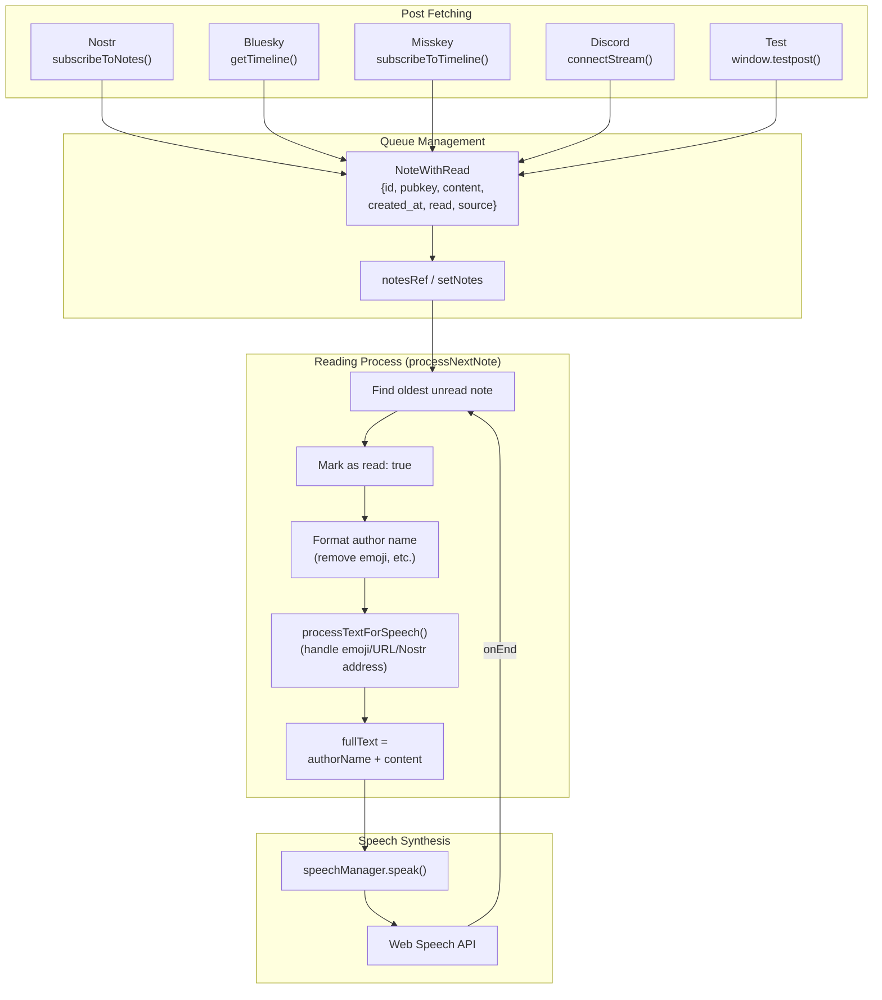

English | [Japanese](README-ja.md)

# yomi - Nostr/Bluesky/Misskey.io/Discord TTS Reading Client
A [Nostr](https://nostter.app)/[Bluesky](https://bsky.app)/[Misskey.io](https://misskey.io)/Discord client that reads out posts using text-to-speech.

## For Users
### Usage
1. Enable and configure your platforms:
   - **Nostr**: Use NIP-07 extension ([nos2x](https://chromewebstore.google.com/detail/nos2x/kpgefcfmnafjgpblomihpgmejjdanjjp) for Chrome, [nos2x-fox](https://addons.mozilla.org/firefox/addon/nos2x-fox/) for Firefox) or enter pubkey manually
   - **Bluesky**: Settings > Privacy and Security > [App Passwords](https://bsky.app/settings/app-passwords) > Enter handle and app password
   - **Misskey\.io**: Settings > [Service integration](https://misskey.io/settings/connect) > Generate access token
   - **Discord**: Create a Discord Bot (see [discord-bot/README.md](discord-bot/README.md)) > Launch the bot with your token and channel ID > Enter WebSocket URL in yomi settings
     ```bash
     cd discord-bot
     npm install
     node bot.cjs --token <BOT_TOKEN> --channel <CHANNEL_ID>
     ```
2. Open [yomi](https://koteitan.github.io/yomi) in your browser
3. Click the gear icon to open the config dialog
4. Click "Start" to begin reading posts from your follows

### Requirements
#### Windows/Mac/iOS/Android
- A modern browser (Chrome, Firefox, Safari, Edge)

#### Linux
- A modern browser with Web Speech API support
- Speech synthesis voices installed:

Ubuntu/Debian:
```bash
sudo apt install speech-dispatcher speech-dispatcher-espeak-ng espeak-ng
```

Arch:
```bash
sudo pacman -S speech-dispatcher espeak-ng
```

### Tested Environments

| OS              | Browser                 | Foreground Playback  | Background Playback  | Bluetooth Playback | Speech Recognition (on device)|Speech Recognition (Bluetooth)|
| --------------- | ----------------------- | -------------------- | -------------------- | ------------------ | ----------------------------- | ---------------------------- |
| Windows 11 25H2 | Chrome 143.0.7499.194   | ✔                    | ✔                    | ✔                  | ✔                             | ✔                            |
| iOS 26.2        | Safari 26.6             | ✔                    |                      | ✔                  | ✔                             |                              |
| Android 13      | Chrome 143.0.7499.194   | ✔                    |                      | ✔                  | ✔                             | ✔                            |
| Android 13      | Firefox Nightly 149.0a1 | ✔                    | ✔                    | ✔                  |                               |                              |

### Supported Languages
Available languages for text-to-speech depend on your browser and OS. Below are commonly supported languages:

| Code | Language | Windows | Mac | Android | iOS |
|------|----------|:-------:|:---:|:-------:|:---:|
| en | English | ✓ | ✓ | ✓ | ✓ |
| ja | 日本語 | ✓ | ✓ | ✓ | ✓ |
| zh | 中文 | ✓ | ✓ | ✓ | ✓ |
| ko | 한국어 | ✓ | ✓ | ✓ | ✓ |
| es | Español | ✓ | ✓ | ✓ | ✓ |
| fr | Français | ✓ | ✓ | ✓ | ✓ |
| de | Deutsch | ✓ | ✓ | ✓ | ✓ |
| it | Italiano | ✓ | ✓ | ✓ | ✓ |
| pt | Português | ✓ | ✓ | ✓ | ✓ |
| ru | Русский | ✓ | ✓ | ✓ | ✓ |
| ar | العربية | ✓ | ✓ | ✓ | ✓ |
| hi | हिन्दी | ✓ | ✓ | ✓ | ✓ |
| th | ไทย | ✓ | ✓ | ✓ | ✓ |
| vi | Tiếng Việt | ✓ | | ✓ | |
| nl | Nederlands | ✓ | ✓ | ✓ | ✓ |
| pl | Polski | ✓ | ✓ | ✓ | ✓ |
| tr | Türkçe | ✓ | ✓ | ✓ | ✓ |
| uk | Українська | ✓ | | ✓ | |

**Note**: On Linux, available languages depend on what `espeak-ng` supports. You can install additional language packs to extend support.

### Auto Language Detection
The "Auto detect by author" and "Auto detect by note" features use [franc-min](https://github.com/wooorm/franc) for language detection. franc-min supports the following 82 languages:

| Code | Language | Code | Language | Code | Language |
|------|----------|------|----------|------|----------|
| amh | አማርኛ | arb | العربية | azj | Azərbaycan |
| bel | Беларуская | ben | বাংলা | bho | भोजपुरी |
| bos | Bosanski | bul | Български | ceb | Cebuano |
| ces | Čeština | ckb | کوردی | cmn | 中文 |
| deu | Deutsch | ell | Ελληνικά | eng | English |
| fra | Français | fuv | Fulfulde | guj | ગુજરાતી |
| hau | Hausa | hin | हिन्दी | hms | 苗语 |
| hnj | Hmong | hrv | Hrvatski | hun | Magyar |
| ibo | Igbo | ilo | Ilokano | ind | Indonesia |
| ita | Italiano | jav | Jawa | jpn | 日本語 |
| kan | ಕನ್ನಡ | kaz | Қазақ | kin | Kinyarwanda |
| koi | Коми | kor | 한국어 | lin | Lingála |
| mad | Madura | mag | मगही | mai | मैथिली |
| mal | മലയാളം | mar | मराठी | mya | မြန်မာ |
| nld | Nederlands | npi | नेपाली | nya | Chichewa |
| pan | ਪੰਜਾਬੀ | pbu | پښتو | pes | فارسی |
| plt | Malagasy | pol | Polski | por | Português |
| qug | Kichwa | ron | Română | run | Kirundi |
| rus | Русский | sin | සිංහල | skr | سرائیکی |
| som | Soomaali | spa | Español | srp | Српски |
| sun | Sunda | swe | Svenska | swh | Kiswahili |
| tam | தமிழ் | tel | తెలుగు | tgl | Tagalog |
| tha | ไทย | tur | Türkçe | ukr | Українська |
| urd | اردو | uzn | Oʻzbek | vie | Tiếng Việt |
| yor | Yorùbá | zlm | Melayu | zul | isiZulu |
| zyb | 壮语 | | | | |

**Note**: For auto language detection to work correctly, the detected language must also be supported by TTS.

## For Developers
### Requirements
- Node.js 18+
- npm

### Build
```bash
npm install
npm run build
```

### Run
```bash
npm run dev
```
Open http://localhost:5173 in your browser.

### Architecture
Flow from fetching posts to speech synthesis:



### WebSocket Debug Mode
Forward all console output to a WebSocket server for remote debugging.

1. Start the WebSocket server:
```bash
node tools/wsserver.cjs > console-log.txt
```

2. Open the app with `?ws=host:port` parameter:
```
http://localhost:5173/?ws=localhost:8080
```

## License
- This project: [MIT License](LICENSE)
- Third-party libraries: [THIRD_PARTY_LICENSES.md](THIRD_PARTY_LICENSES.md)
