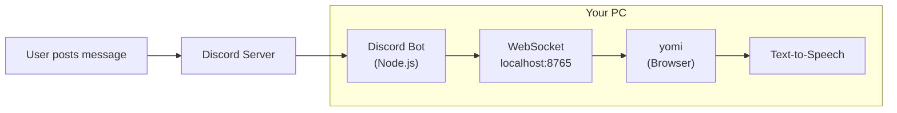
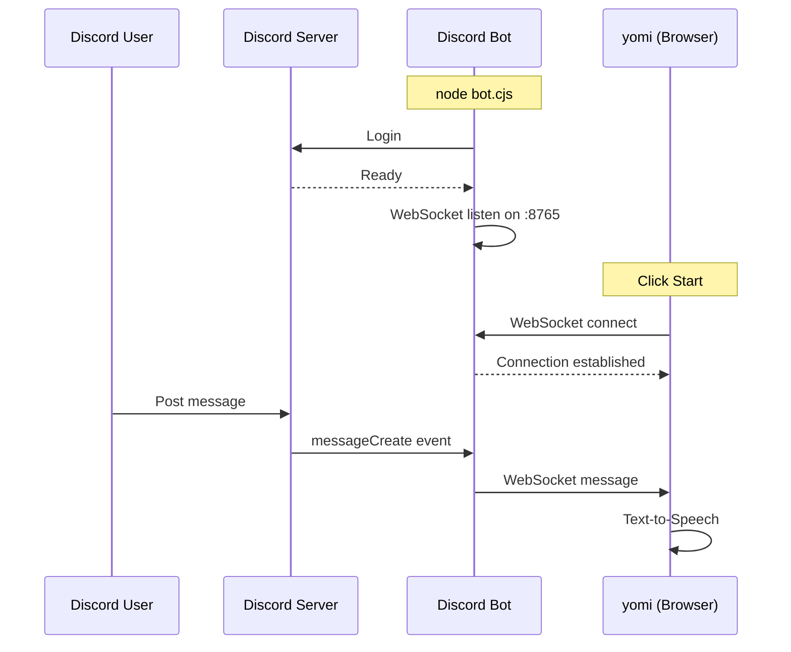

# yomi Discord Bot

A bot that forwards Discord channel messages to yomi for text-to-speech reading.

## Architecture

### Block Diagram



### Communication Chart



## Setup

### 1. Create a Discord Application

1. Go to [Discord Developer Portal](https://discord.com/developers/applications)
2. Click **New Application**
3. Enter an app name (e.g., "yomi Bot") and click **Create**

### 2. Create Bot and Get Token

1. Select **Bot** from the left menu
2. Click **Reset Token** and copy the token (**keep this secret!**)
3. Enable **MESSAGE CONTENT INTENT** (important!)
   - Scroll down to "Privileged Gateway Intents" section
   - Turn ON "MESSAGE CONTENT INTENT"
4. Click **Save Changes**

### 3. Invite Bot to Your Server

1. Select **OAuth2** > **URL Generator** from the left menu
2. Under SCOPES, check `bot`
3. Under BOT PERMISSIONS, check:
   - `Read Messages/View Channels`
   - `Read Message History`
4. Copy the generated URL at the bottom and open it in your browser
5. Select the server you want to add the bot to and authorize

### 4. Get Channel ID

1. Enable Developer Mode in Discord
   - User Settings > App Settings > Advanced > Developer Mode (ON)
2. Right-click the channel you want to read from
3. Click **Copy Channel ID**

## Run the Bot

```bash
cd discord-bot
npm install
node bot.cjs --token <BOT_TOKEN> --channel <CHANNEL_ID>
```

### Options

| Option | Description | Default |
|--------|-------------|---------|
| `--token` | Discord Bot token (required) | - |
| `--channel` | Channel ID to monitor (required) | - |
| `--port` | WebSocket server port | 8765 |

### Example

```bash
node bot.cjs --token MTIz... --channel 123456789012345678 --port 8765
```

## Configure yomi

1. Open yomi settings (gear icon)
2. Enable **Discord** checkbox
3. Enter Bot URL: `ws://localhost:8765` (default)
4. Click **Start** to begin reading

## Troubleshooting

### Messages not arriving

- Verify the bot has joined your server
- Check bot has permission to view the channel
- Confirm MESSAGE CONTENT INTENT is enabled in Developer Portal
- Verify the channel ID is correct

### Connection errors

- Check the bot token is correct
- Ensure the WebSocket port is not blocked by firewall
