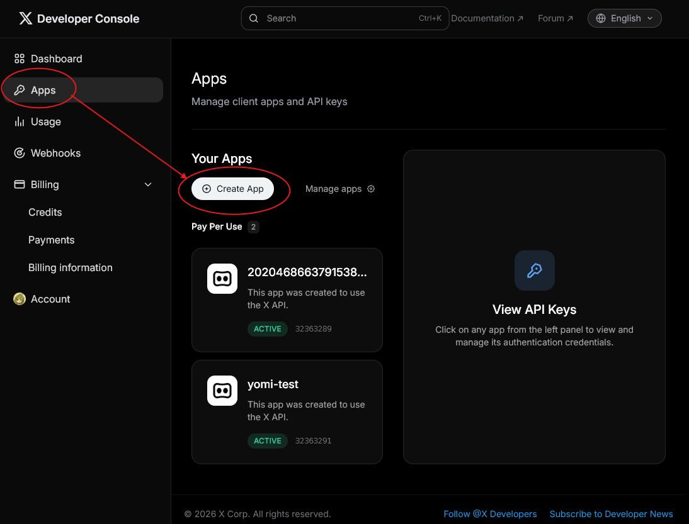
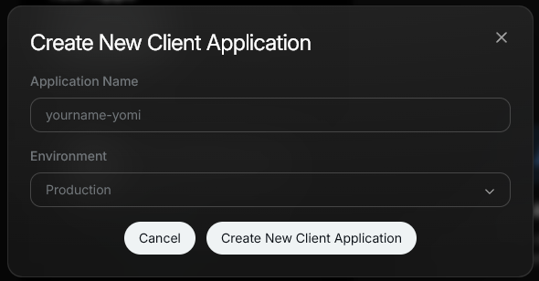
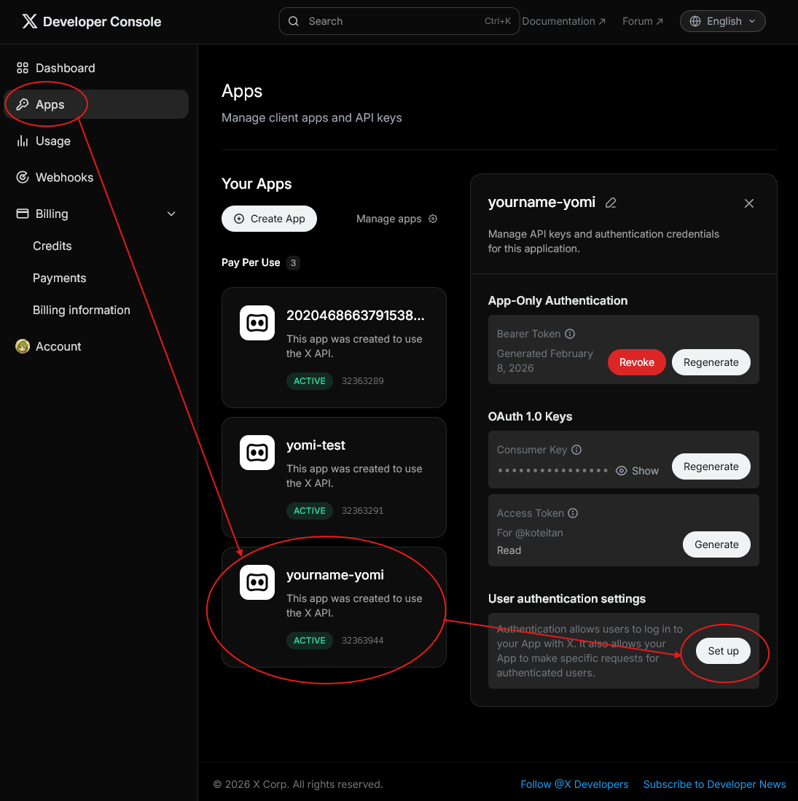
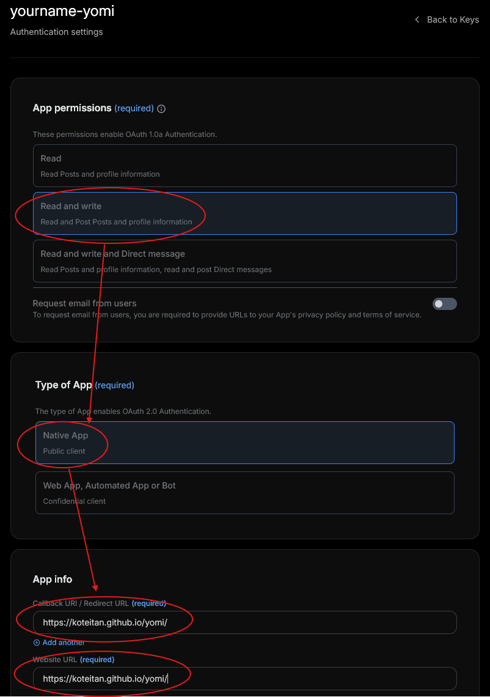
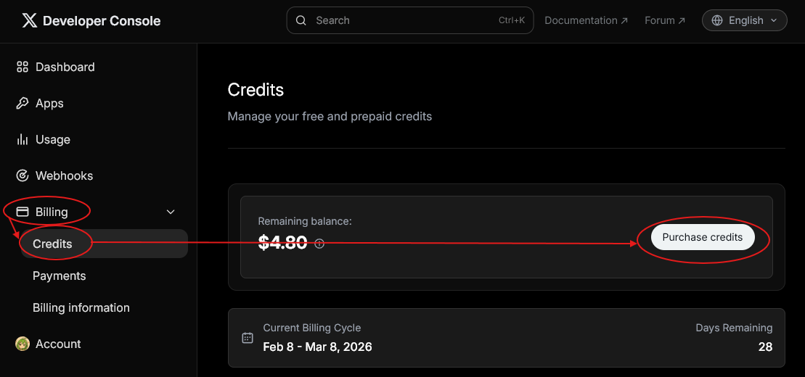

# How to Get Client ID of X/Twitter

## Steps

### 1. Access X Developer Portal
Go to [https://developer.x.com](https://developer.x.com) and sign in with your X account.

### 2. Create a Project & App
Click "Create App" button to create a new app.

- Fill in the app name for example, "[yourname]-yomi"
- Fill in the Environment by selecting "Production"

### 3. Set Up User Authentication
Click "Set up" button in the User authentication settings section.

### 4. Configure OAuth 2.0 Settings
Configure the following settings:

- **App permissions**: Read and write
- **Type of App**: Native App (Public client)
- **Callback URI / Redirect URL**: `https://koteitan.github.io/yomi/`
- **Website URL**: `https://koteitan.github.io/yomi/`

Click "Save" to save the settings.

### 5. Copy Client ID
After saving, you will see the Client ID. Copy it.

### 6. Purchase API Credits
Go to Billing > Credits and click "Purchase Credits" button to purchase API credits.

### 7. Paste into yomi
Open yomi settings, enable "X/Twitter", and paste the Client ID into the input field.
